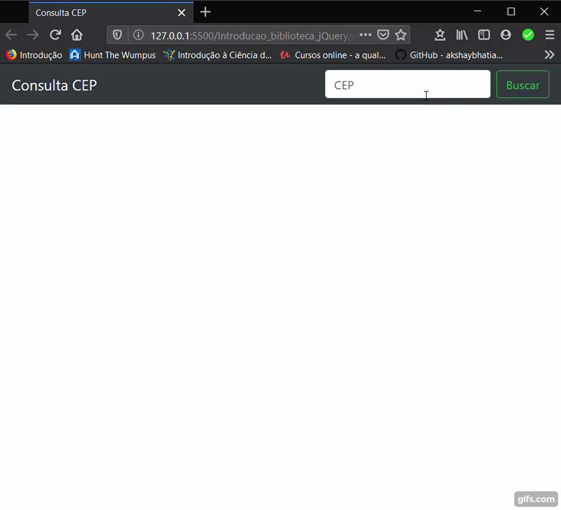

# Introdução à Biblioteca JQuery
> Um modelo simples de site para consulta de endereço através do CEP.

## Getting Started
Foi utilizado a biblioteva JQuery e o framework bootstramp para a construção dessa página. Na qual realiza uma requisição para a página [viacep](https://viacep.com.br/ "viacep") e recebe um arquivo *json* contendo o *logradouro, bairro, cidade e estado* do cep informado. 

### Referências
- [https://viacep.com.br/](https://viacep.com.br/ "https://viacep.com.br/")

### Requisitos
- [https://getbootstrap.com/](https://getbootstrap.com/ "https://getbootstrap.com/")

-[https://jquery.com/](https://jquery.com/ "https://jquery.com/")

### Demonstração
